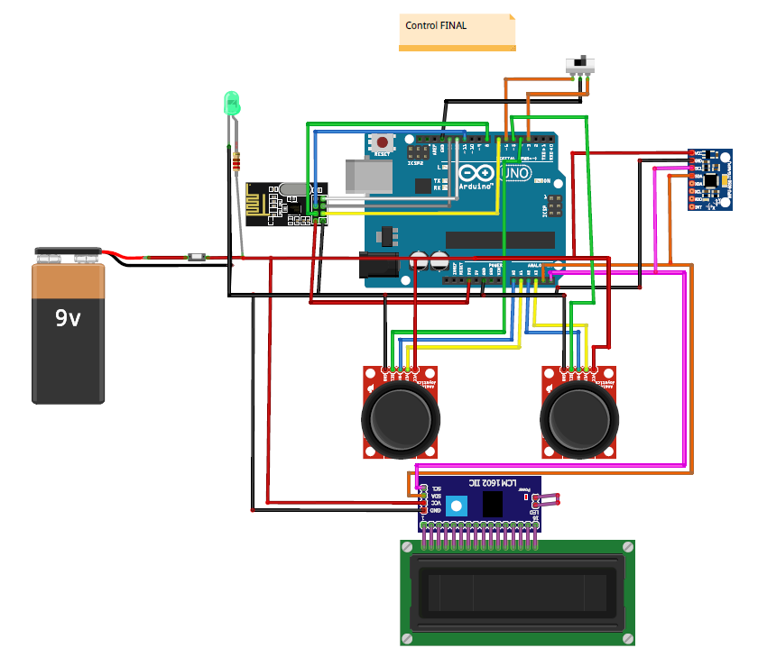

# orbitMove

<h1>Resumen</h1>
Carro a control remoto desarrollado en Arduino, el cual establece comunicación por medio del modulo RF NRF24l01. El control cuenta con dos modalidades, manejo por medio de joysticks o por movimiento del control utilizando la funcionalidad del giroscopio.

<h1>Diagramas</h1>
<h3>Control sencillo</h3>

<h3>Control con giroscopio</h3>

<h3>Control final</h3>

<h3>Circuito carro</h3>

<h3>Funcionamiento</h3>
https://youtu.be/dZ6whlAr8E8
